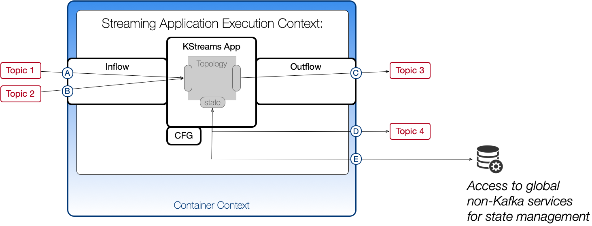

# kstreams-perf-test
Simplify performance analysis for KStreamsApplications.

<a href="https://codeclimate.com/github/kamir/kstreams-perf-test"></a>  [](https://travis-ci.org/kamir/kstreams-perf-test)

-----

## Table of Contents

* [Concepts](#Concepts)
    * [Cluster Profile](#Cluster-Profile)
    * [Workload Profile](#Workload-Profile)
* [Example Workloads](#Procedure)
    * [Quick-Start: Confluent-Platform](#Quick-Start-using-Confluent-Platform)
    * [Test-Setup: Multi node cluster with Monitoring](#Test-Setup)
    * [Application Benchmark with Confluent Cloud](#CCloud)
        * [kafka-perf-test & kafka-console-cosumer](#CCloud-simple)
        * [kafka-streams-example](#CCloud-kse)


    
-----

## Why does this project exist?
To make sure that your KStreams applications perform well, you need a way to measure how well they really do.

We have to understand what influences a particular application.
Furthermore we should be able to know the impact of our application on other applications or the entire cluster.

Many well written tutorials and example projects can support you already while you are _learning to write efficient KStreams applications_.

_Monitoring Kafka_ is a critical skill and also a very present topic at many conferences.

Assuming we are able to develop KStreams applications, and assuming we ar able to monitor the clusters in which they run, than
we can go further and start asking:

+ What do we know about the behavior of a particular workload in a particular environment?
+ How well does a workload fit into an environment?
+ What are the limits of a workload? When will it fail due resource limits?
+ What is the optimization potential for a workload in a given cluster?

This projects provides example programs, reference workloads, and a systematic analysis procedure.



We define workload types and workload profiles to describe the conditions of a particular KStreams program.
These tools can be used together to answer the questions above.

-------

<a name="Concepts"/>

## Concepts

<a name="Cluster-Profile"/>

### Cluster Profile
The [Confluent performance tuning whitepaper](https://www.confluent.io/white-paper/optimizing-your-apache-kafka-deployment/) explains which settings influence which aspects in an Apache Kafka cluster. Some settings are applied on a cluster wide level, others are per consumer / producer or even per topic.

Only in cases where your cluster is used for one single use case, which is implemented using a single workload type we can keep it simple and analyse the overall system as one.

The majority of installations is either created for mixed workloads or as multi-tennant environments. In this case, we have to look into cluster profile and workload profiles on an individual level.

This [worksheet](tools/workbook_010.xlsx) allows tracking of cluster wide settings over time.

<a name="Workload-Profile"/>

### Workload Profile
A workload profile is a structured description of a workload. It provides a set of measures, such as required read bandwidth, memory footprint, write bandwidth for results and intermediate data. Also rather static resources, such as CPU and RAM are relevant for workload profiles - because workload scheduling and workload placement decisions depend on them.

**Workload Profile for KStreams Application:**  *ByteLevelReverse* (type 1)

| Property  | Purpose  | Value  |
|---|---|---|
| CPU / threads  | enable parallelity over partitions  |   |
| memory footprint | to store processing state, <br/>to hold side data like lookup tables, <br/>to store models in ML apps  |   |   |   |
| read throughput <br/>for loading input data  | permanently, depending on source data ingestion rate  |   |
| write throughput  | for results - permanently according to input rate   |   |
| read throughput <br/>for state  | on restart / failover  |   |
| write throughput <br/>for state  | on state commit  |   |

<a name="Procedure"/>

# How To Run Example Workloads?

<a name="Quick-Start-using-Confluent-Platform"/>

## Quick-Start - Using Confluent Platform (locally installed)

### Prerequisites:
+ Confluent platform is installed. You can download it [here](https://www.confluent.io/download).
+ Docker and Docker compose are installed

### Preparation:
First, you should prepare your environment so that you can use the Confluent platform tools.
If not done yet, please define `JAVA_HOME` and `CONFLUENT_HOME` environment variables.
```
export JAVA_HOME=/Library/Java/JavaVirtualMachines/jdk1.8.0_221.jdk/Contents/Home
export CONFLUENT_HOME=<<<PATH TO YOUR CONFLUENT PLATFORM INSTALLATION>>>/bin/confluent-5.4.0
```
### Step by Step Approach:
We simulate a data ingestion workload using the `kafka-producer-perf-test`. Some other data generators are available, but more on this later.

+ start the `kafka-producer-perf-test` to generate some test data into topic *t1*.

The sample message producer can be executed with this command:
```
$CONFLUENT_HOME/bin/kafka-producer-perf-test --topic t1 --num-records 10 --record-size 1024 --throughput -1 --producer-props acks=1 bootstrap.servers=127.0.0.1:9092 buffer.memory=67108864 batch.size=8196
```
In case you are interested in more metrics and more details, please append the argument: `--print-metrics`.

+  start the KStreams performance testing app in this project, using the default settings, defined in the `pom.xml`file.

```
mvn clean compile exec:java
```

+ you can also specify your own arguments like this:

```
mvn clean compile exec:java -Dexec.args="-it t1 -ot t1REV --bootstrap.servers localhost:9092 -cg byte-reverse-app-1"
```

This will execute a workload of type 1 (Simple Stream-mapping application) to transform the generated data from topic *t1*.
Results will be available in topic *t1REV*.

### Clean-Up Procedure

```
$CONFLUENT_HOME/bin/kafka-topics --delete --topic t1 --bootstrap-server=127.0.0.1:9092
$CONFLUENT_HOME/bin/kafka-topics --delete --topic t1REV --bootstrap-server=127.0.0.1:9092
```

<a name="Test-Setup"/>

## Test-Setup: Multi node Cluster with Monitoring

The project `https://github.com/jeanlouisboudart/kafka-platform-prometheus` contains a ready to use confluent platform
including Prometheus and Grafana for monitoring and metrics visualization.

Please follow the guide in this project to prepare your setup, in case you want to practice the procedure with a dedicated Confluent platform.

In order to integrate the KStreams performance test app, we have to modify the docker-compose file.

### Prepare a Demo Workload Container

First, build the `kstreams-perf-test` project locally and create the docker image using the commands:
```
mvn clean compile assembly:single
docker build . -t kstreams-perf-test-app
```

Now, append the following snippet to the existing file `kafka-platform-prometheus/docker-compose.yml`.

```
  #
  #  Example workloads for KStreams performance testing
  #
  kstreams-1:
    image: kstreams-perf-test-app
    environment:
      JAVA_OPTS: -javaagent:/usr/share/jmx_exporter/jmx_prometheus_javaagent-0.12.0.jar=1234:/usr/share/jmx_exporter/kafka-producer.yml -Xmx256M -Xms256M
      STREAMS_SCHEMA_REGISTRY_HOST: schema-registry
      STREAMS_SCHEMA_REGISTRY_PORT: 8081
    volumes:
      - jmx-exporter-vol:/usr/share/jmx_exporter/
    depends_on:
      - jmx-exporter
      - kafka-1
      - kafka-2
      - kafka-3
      - schema-registry

  #
  # Some applications require a Schema-Registry
  #
  schema-registry:
    image: confluentinc/cp-schema-registry:5.4.1
    hostname: schema-registry
    ports:
      - 8081:8081
    environment:
      SCHEMA_REGISTRY_KAFKASTORE_BOOTSTRAP_SERVERS: kafka-1:9092,kafka-2:9092,kafka-3:9092
      SCHEMA_REGISTRY_HOST_NAME: schema-registry
      SCHEMA_REGISTRY_LISTENERS: http://0.0.0.0:8081
      SCHEMA_REGISTRY_DEBUG: "true"
    depends_on:
      - zookeeper-1
      - zookeeper-2
      - zookeeper-3
      - kafka-1
      - kafka-2
      - kafka-3
```
With 'docker-compose' we can start the Confluent platform with 3 brokers. The container named *kstreams-1* contains the JAR files which define our demo workloads.

### Run a Benchmark in the Test-Cluster using Docker-Compose

#### Create a Topic for Test Data
Create the `demo-perf-topic` and `demo-perf-topic-REVERSE` with 4 partitions and 3 replicas.
```
docker-compose exec kafka-1 bash -c 'KAFKA_OPTS="" kafka-topics --create --partitions 4 --replication-factor 3 --topic demo-perf-topic --zookeeper zookeeper-1:2181'
docker-compose exec kafka-1 bash -c 'KAFKA_OPTS="" kafka-topics --create --partitions 4 --replication-factor 3 --topic demo-perf-topic-REVERSE --zookeeper zookeeper-1:2181'
```

#### Produce Random Messages Into Topic _demo-perf-topic_
Open a new terminal window (in the same folder where the `docker-compose.yml` is located) and generate random messages to simulate producer load.
```
docker-compose exec kafka-1 bash -c 'KAFKA_OPTS="" kafka-producer-perf-test --throughput -1 --num-records 10000000 --topic demo-perf-topic --record-size 160 --producer-props acks=1 buffer.memory=67108864 batch.size=8196 bootstrap.servers=kafka-1:9092'
```

#### Process Random Messages Using a KStreams-Application
Open a new terminal window and start the streaming application.
```
docker-compose exec kstreams bash -c 'KAFKA_OPTS="" java -jar kstreams-perf-test-1.0-SNAPSHOT-jar-with-dependencies.jar -it demo-perf-topic -ot demo-perf-topic-REVERSE --bootstrap.servers kafka-1:9092 -cg byte-reverse-app-1'
```

#### Run a KStreams-Example Applications
The following commands have to be executed in your `docker-compose` project folder from which the Confluent Platform has been started.

The next four commands can be executed in a sequence:
```
docker-compose exec kstreams-1 bash -c 'KAFKA_OPTS="" ls'
docker-compose exec kafka-1 bash -c 'KAFKA_OPTS="" kafka-topics --create --partitions 1 --replication-factor 1 --topic PageViews --zookeeper zookeeper-1:2181'
docker-compose exec kafka-1 bash -c 'KAFKA_OPTS="" kafka-topics --create --partitions 1 --replication-factor 1 --topic UserProfiles --zookeeper zookeeper-1:2181'
docker-compose exec kafka-1 bash -c 'KAFKA_OPTS="" kafka-topics --create --partitions 1 --replication-factor 1 --topic PageViewsByRegion --zookeeper zookeeper-1:2181'
```
Now, we have to work in three parallel terminal windows:
```
docker-compose exec kstreams-1 bash -c 'KAFKA_OPTS="" java -cp ./kafka-streams-examples-5.4.1-standalone.jar io.confluent.examples.streams.PageViewRegionLambdaExample kafka-1:9092 http://schema-registry:8081'
docker-compose exec kstreams-1 bash -c 'KAFKA_OPTS="" java -cp ./kafka-streams-examples-5.4.1-standalone.jar io.confluent.examples.streams.PageViewRegionExampleDriver kafka-1:9092 http://schema-registry:8081'
docker-compose exec kafka-1 bash -c 'KAFKA_OPTS="" kafka-console-consumer --topic PageViewsByRegion --from-beginning --bootstrap-server kafka-1:9092 --property print.key=true --property value.deserializer=org.apache.kafka.common.serialization.LongDeserializer'
```

<a name="CCloud"/>

## Run a Benchmark using Confluent Cloud

### Prerequisites:
+ Confluent cloud CLI has to be installed. You can download it [here](https://docs.confluent.io/current/cloud/cli/install.html).
+ The project has to be compiled and the UBER-JAR needs to be created.

```
mvn clean compile package install assembly:single
```

#### Create a Topic for Test Data
We create the `demo-perf-topic` and `demo-perf-topic-REVERSE` with 6 partitions.
```
ccloud login
ccloud kafka cluster list
ccloud kafka cluster use <<YOUR_CLUSTER_ID>>
ccloud api-key list
ccloud api-key use <<API-KEY>> --resource <<YOUR_CLUSTER_ID>>
ccloud kafka topic create demo-perf-topic --partitions 6
ccloud kafka topic create demo-perf-topic-REVERSE --partitions 6
```

#### Clean-Up Procedure
```
ccloud kafka topic delete demo-perf-topic
ccloud kafka topic delete demo-perf-topic-REVERSE
```

#### Prepare Client Access: Create a `client.properties` File
Go to your confluent cloud web interface and copy the client configuration file.
We need this file locally in our working directory for the following steps.

Please use the filename `ccloud.props` because then it will be excluded from the GitHub repository which is the secure option.

```
# Kafka
bootstrap.servers=pkc-43n10.us-central1.gcp.confluent.cloud:9092
security.protocol=SASL_SSL
sasl.jaas.config=org.apache.kafka.common.security.plain.PlainLoginModule   required username="{{ CLUSTER_API_KEY }}"   password="{{ CLUSTER_API_SECRET }}";
ssl.endpoint.identification.algorithm=https
sasl.mechanism=PLAIN
# Confluent Cloud Schema Registry
schema.registry.url=https://psrc-4v1qj.eu-central-1.aws.confluent.cloud
basic.auth.credentials.source=USER_INFO
schema.registry.basic.auth.user.info={{ SR_API_KEY }}:{{ SR_API_SECRET }}
```

<a name="CCloud-simple"/>

#### Produce Random Messages Into Topic _demo-perf-topic_
Open a new terminal window (in the same folder where the `docker-compose.yml` is located) and generate random messages to simulate producer load.

We use the kafka client tools which are locally installed as part of the Confluent platform.
We prepare the stage as in step 1 of the quickstart.

```
export JAVA_HOME=/Library/Java/JavaVirtualMachines/jdk1.8.0_221.jdk/Contents/Home
export CONFLUENT_HOME=<<<PATH TO YOUR CONFLUENT PLATFORM INSTALLATION>>>/bin/confluent-5.4.0
```
We simulate a data ingestion workload using the `kafka-producer-perf-test`. Some other data generators are available, but more on this later.

The sample message producer can be executed with this command:
```
$CONFLUENT_HOME/bin/kafka-producer-perf-test --topic demo-perf-topic --num-records 10 --record-size 1024 --throughput -1 --producer.config ccloud.props --producer-props acks=1 buffer.memory=67108864 batch.size=8196
```
The KStreams application will be started with the following command:
```
KAFKA_OPTS="" java -jar target/kstreams-perf-test-1.0-SNAPSHOT-jar-with-dependencies.jar -it demo-perf-topic -ot demo-perf-topic-REVERSE --producer.config ccloud.props -cg byte-reverse-app-1'
```

<a name="CCloud-kse"/>

### How To Run a kafka-streams-example as Reference Workload?

Next, we want to run the KStreams applications also against out Confluent Cloud cluster.

#### Run a KStreams-Example Applications with Confluent Cloud
We prepare the topics using the following commands:
```
ccloud kafka topic create PageViews --partitions 1
ccloud kafka topic create UserProfiles --partitions 1
ccloud kafka topic create PageViewsByRegion --partitions 1
```

We run the two programs in parallel terminal windows:
```
KAFKA_OPTS="" java -cp ./lib/kafka-streams-examples-5.4.1-standalone.jar io.confluent.examples.streams.PageViewRegionExampleDriver - - ccloud.props
KAFKA_OPTS="" java -cp ./lib/kafka-streams-examples-5.4.1-standalone.jar io.confluent.examples.streams.PageViewRegionLambdaExample - - ccloud.props
```

Consuming the results is also possible via `kafka-console-consumer:`, please remember to make sure that the environment `CONFLUENT_HOME` and `JAVA_HOME` variables are defined for your system.
```
KAFKA_OPTS="" $CONFLUENT_HOME/bin/kafka-console-consumer --topic PageViewsByRegion --consumer.config ccloud.props --from-beginning --bootstrap-server pkc-43n10.us-central1.gcp.confluent.cloud:9092 --property print.key=true --property value.deserializer=org.apache.kafka.common.serialization.LongDeserializer
```

#### Clean-Up Procedure
```
ccloud kafka topic delete PageViews
ccloud kafka topic delete UserProfiles
ccloud kafka topic delete PageViewsByRegion
```

# Summary 

This project helps you to prepare a test setup which includes:
+ Confluent platform CLI
+ a Confluent cluster (localy, using docker-compose, using Confluent cloud)
+ metrics exporter and Grafana dashboards
+ example workloads from kafka-streams-example project
+ a set of reference workloads (part of this project).


# Where to go from here?

A systematic performance analysis of your application can be done.

This project provides some tools to support your performance analysis and research.

+ Create a cluster profile with our (cluster-profiler spread-sheet)[tools/workbook_010_cluster.xlsx]
+ Create a workload profile with our (workload-profiler spread-sheet)[tools/workbook_020_kstreams_application.xlsx]
+ Work on optimizations: 
++ tune cluster settings 
++ tune application configuration settings
 
